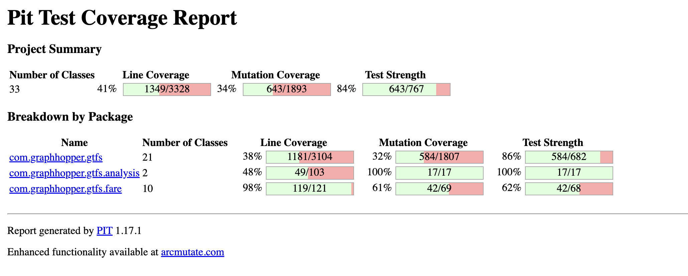
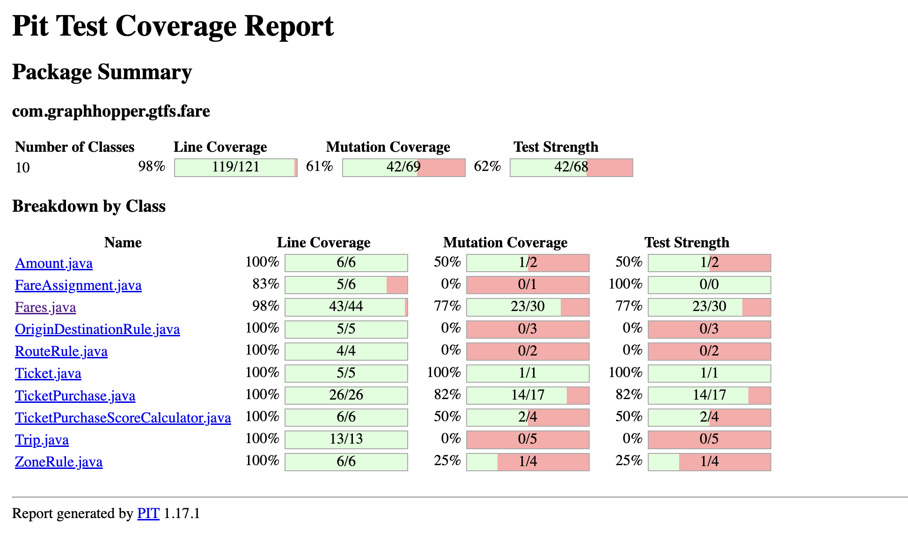
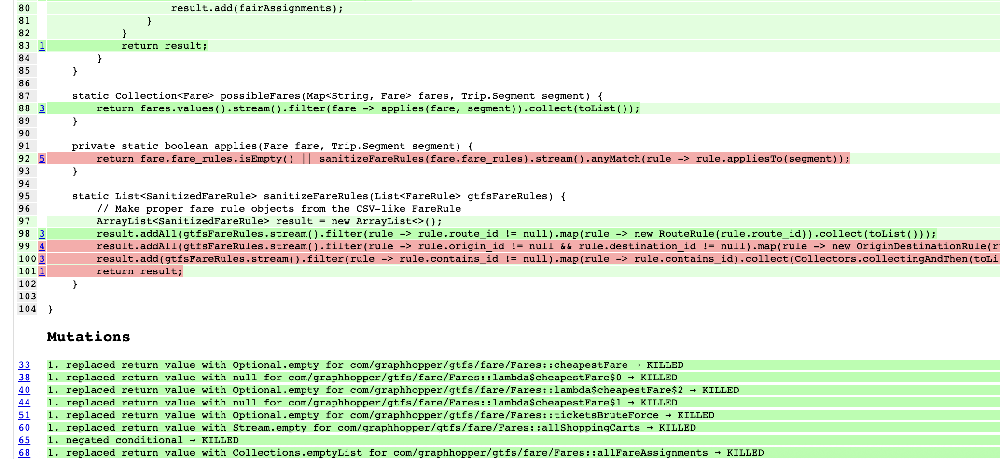
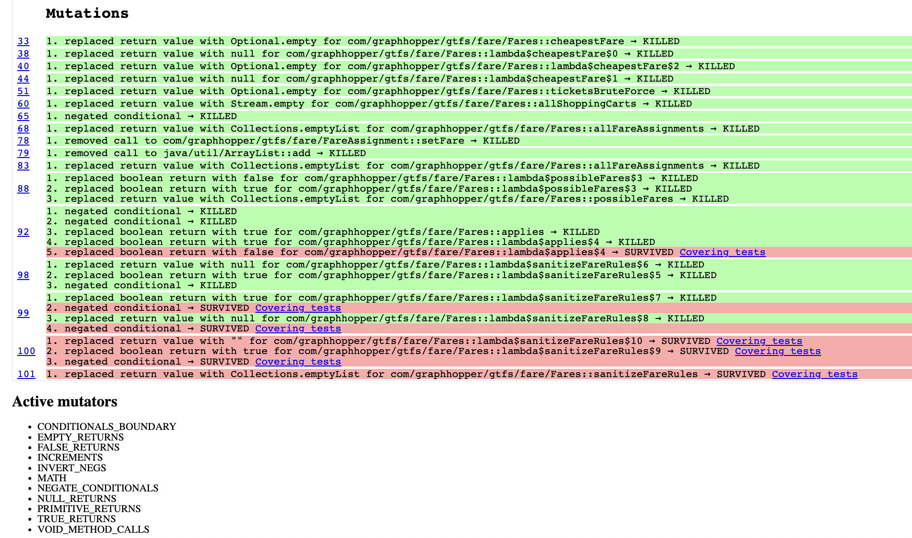
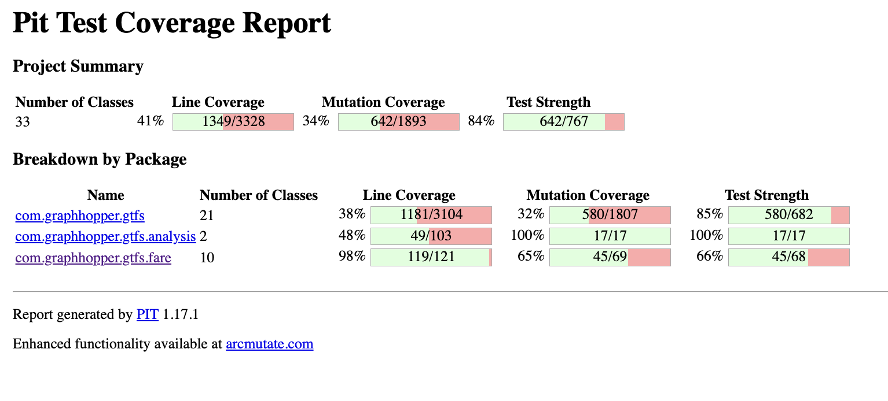
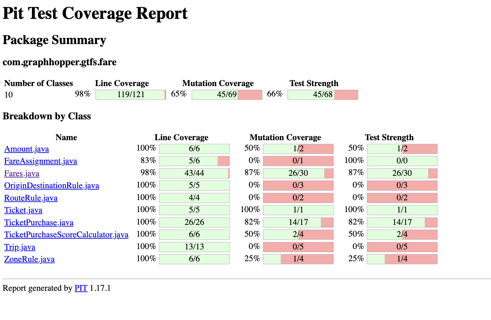
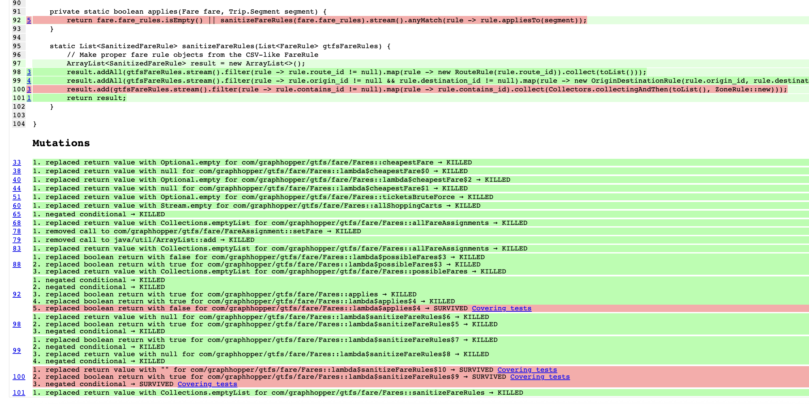
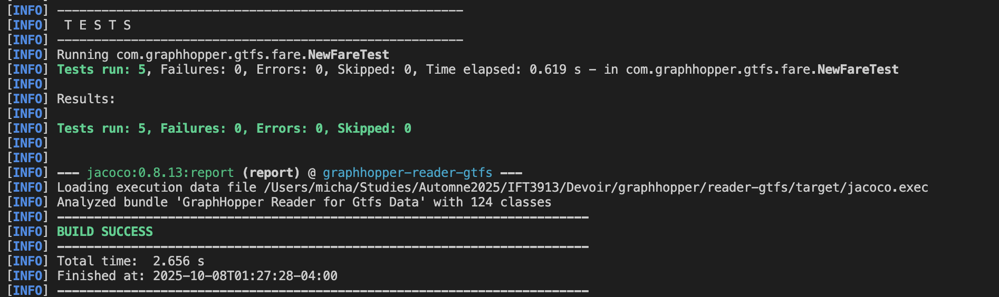

# Tâche 2 : Tests unitaires Automatiques

**Autrices :** Chaimaa Dannane 
**Date :** 7 octobre 2025
**Module :** `reader-gtfs`
**Classe testée:** `com.graphhopper.gtfs.fare.Fares`
**Contribution :** 5 tests (dont 1 java-faker)

---

## Table des matières

1. [Classe sélectionnée](#1-classe-sélectionnée)
2. [Configuration du projet](#2-configuration-du-projet)
3. [Analyse de mutation AVANT les nouveaux tests](#3-analyse-de-mutation-avant-les-nouveaux-tests)
4. [Documentation des 7 nouveaux tests](#4-documentation-des-7-nouveaux-tests)
5. [Analyse de mutation APRES les nouveaux tests](#5-analyse-de-mutation-après-les-nouveaux-tests)
6. [Exécution et validation](#6-exécution-et-validation)
---

## 1. Classe sélectionnée

### 1.1 Identification

**Classe :** `Fares.java`  
**Package :** `com.graphhopper.gtfs.fare`  
**Chemin :** [reader-gtfs/src/main/java/com/graphhopper/gtfs/fare/Fares.java](reader-gtfs/src/main/java/com/graphhopper/gtfs/fare/Fares.java)

### 1.2 Justification du choix

Cette classe a été sélectionnée pour les raisons suivantes :

- **Couverture de code existante élevée** : 98% (43/44 lignes)
- **Score de mutation initial modéré** : 77% (23/30 mutants tués)
- **7 mutants survivants identifiés** : Possibilité de créer plusieurs tests ciblés
- **Complexité raisonnable** : Méthodes testables avec des dépendances gérables


La classe `Fares` gère le calcul des tarifs pour les trajets de transport en commun, incluant :
- Le calcul du tarif le moins cher pour un trajet
- La gestion des règles tarifaires (routes, zones, origine-destination)
- L'application des restrictions tarifaires

---

## 2. Configuration du projet

### 2.1 Ajout de PiTest

**Version :** 1.17.1  
**Plugin JUnit5 :** 1.2.1

**Configuration dans [reader-gtfs/pom.xml](reader-gtfs/pom.xml) :**

```xml
<plugin>
    <groupId>org.pitest</groupId>
    <artifactId>pitest-maven</artifactId>
    <version>1.17.1</version>
    <dependencies>
        <dependency>
            <groupId>org.pitest</groupId>
            <artifactId>pitest-junit5-plugin</artifactId>
            <version>1.2.1</version>
        </dependency>
    </dependencies>
    <configuration>
        <targetClasses>
            <param>com.graphhopper.reader.gtfs.*</param>
            <param>com.graphhopper.gtfs.*</param>
        </targetClasses>
        <targetTests>
            <param>com.graphhopper.gtfs.*</param>
            <param>com.graphhopper.reader.gtfs.*</param>
        </targetTests>
        <outputFormats>
            <param>HTML</param>
            <param>XML</param>
        </outputFormats>
        <timestampedReports>false</timestampedReports>
        <mutationThreshold>30</mutationThreshold>
        <coverageThreshold>0</coverageThreshold>
        <timeoutConstant>3000</timeoutConstant>
        <verbose>true</verbose>
        <threads>2</threads>
        <failWhenNoMutations>false</failWhenNoMutations>
                    <jvmArgs>
                        <value>-Xmx1200m</value>
                        <value>-Xms1200m</value>
                    </jvmArgs>
                    <useClasspathFile>true</useClasspathFile>
    </configuration>
</plugin>
```

### 2.2 Ajout de java-faker

**Version :** 1.0.2

**Dépendance ajoutée dans [reader-gtfs/pom.xml](reader-gtfs/pom.xml) :**

```xml
<dependency>
    <groupId>com.github.javafaker</groupId>
    <artifactId>javafaker</artifactId>
    <version>1.0.2</version>
    <scope>test</scope>
</dependency>
```

---

## 3. Analyse de mutation AVANT les nouveaux tests

### 3.1 Exécution de PiTest

**Commande exécutée :**
```bash
cd reader-gtfs
mvn clean test org.pitest:pitest-maven:mutationCoverage
```

**Temps d'exécution :** 2 minutes 53 secondes

### 3.2 Résultats globaux du module reader-gtfs

**Statistiques globales (tous les fichiers) :**
- **Couverture de lignes :** 41% (1349/3328)
- **Mutations générées :** 1893
- **Mutations tuées :** 643 (34%)
- **Mutations sans couverture :** 1126
- **Force des tests :** 84%
- **Tests exécutés :** 1387

### 3.3 Résultats pour Fares.java

**Métriques spécifiques :**
- **Line Coverage :** 98% (43/44)
- **Mutation Coverage :** 77% (23/30)
- **Test Strength :** 77% (23/30)

**Interprétation :**
- 23 mutants tués par les tests existants
- **7 mutants survivants** à cibler avec nos nouveaux tests
- Des comportements limites non testés

**Rapport PiTest :** [rapport-pitest-avant/index.html](reader-gtfs/rapport-pitest-avant/index.html)






### 3.4 Identification des mutants survivants ciblés

Les mutants survivants ont été identifiés dans le rapport PiTest détaillé :

| Ligne | Mutant | Type | Mon test |
|-------|--------|------|----------|
| 92 | `replaced boolean return with false` | Retour booléen | Test 1 |
| 99 | `negated conditional` | Condition négative (origin_id) | Test 2 |
| 99 | `negated conditional` | Condition négative (destination_id) | Test 2 |
| 100 | `replaced boolean return with true` | Retour booléen | Test 3 |
| 100 | `negated conditional` | Condition négative | Test 3 |
| 100 | `replaced return value with ""` | Retour chaîne | Test 4 |
| 101 | `replaced return with Collections.emptyList` | Retour collection | Test 5 |






---

## 4. Documentation des 5 nouveaux tests

**Fichier créé :** [reader-gtfs/src/test/java/com/graphhopper/gtfs/fare/NewFareTest.java](reader-gtfs/src/test/java/com/graphhopper/gtfs/fare/NewFareTest.java)

### Test 1 : `AppliesReturnTrueWhenFareHasNoRulesTest`

**Mutant ciblé :** Ligne 92 - `replaced boolean return with false for lambda$applies$4`

**Intention du test :**  
Vérifier que la méthode `applies()` retourne `true` quanf `fare_rules` est vide. Une fare sans règle doit s'appliquer à tous les segments.

**Données de test :**
- **Fare :** `fare_id = "test_fare"`,  liste vide
- **Segment :** `feed_id = "feed_1"`, `route = "Route_001"`, stations quelconques, pas de zones

**Oracle :**  
`possibleFares(map(fare), segment)` doit contenir la `fare` testée.

---

### Test 2 : `SanititizeFareRulesCreatesOriginDestinationRuleWhenBothIdsPresentTest`

**Mutants ciblés :** Ligne 99 - `negated conditional` (pour `origin_id` et `destination_id`)

**Intention du test :**  
Vérifier que `sanitizeFareRules()` crée une règle d'origine-destination `OriginDestinationRule` lorsque les deux IDs `origin_id` et `destination_id sont présents dans une FareRule.

**Données de test :**
- **FareRule :** `origin_id = "zoneA"`, `destination_id = "zoneB"`, autres champs = `null`

**Oracle :**  
La liste doit contenir exactement 1 `OriginDestinationRule`. Si l'un des conditionnels est inversé, le filtre échoue et aucune règle n'est créée.

---

### Test 3 : `SanitizefareRulesCreatesZoneRuleWhenContainsIdPresentTest`

**Mutants ciblés :** Ligne 100 - `negated conditional`, `replaced boolean return with true`

**Intention du test :**  
Vérifier que `sanitizeFareRules()` crée une `ZoneRule` qui regroupe toutes les zones (`contains_id`) présents dans les règles `FareRule`.

**Données de test :**
- **2 FareRule :** `contains_id = "zoneA"` et `contains_id = "zoneB"`

**Oracle :**  
La liste doit contenir exactement 1 `ZoneRule` (les 2 zones sont regroupées dans un seul objet). Si le conditionnel est inversé, aucune zone ne sera collectée.

---

### Test 4 : `SanitizeFareRulesCreatesEmptyZoneRuleWhenNoContainsIdTest`

**Mutant ciblé :** Ligne 100 - `replaced return value with ""` (dans lambda qui mappe `contains_id`)

**Intention du test :**  
Vérifier que `sanitizeFareRules()` crée une règle de zone `ZoneRule` même lorsque `contains_id` est absent dans une `FareRule`.

**Données de test :**
- **FareRule :** `route_id = "Route_000"`, `contains_id = null`

**Oracle :**  
La liste doit contenir 1 `ZoneRule` (avec une zone vide). Si le mutant remplace la valeur par une chaîne vide, cela pourrait affecter la création de la règle.
---

### Test 5 : `SanitizeFareRulesNeverReturnsEmptyListTest`

**Mutant ciblé :** Ligne 101 - `replaced return value with Collections.emptyList`

**Intention du test :**  
Vérifier que `sanitizeFareRules()` ne retourne **jamais** une liste vide même avec des données aléatoires.

**Données de test (générées avec JavaFaker) :**
- **FareRule 1 :** `route_id = faker.regexify("Route_[0-9]{3}")` → Ex: `"Route_123"`
- **FareRule 2 :** `origin_id = faker.address().cityName()`, `destination_id = faker.address().cityName()` → Ex: `"Montréal"`, `"Québec"`
- **FareRule 3 :** `contains_id = faker.regexify("zone[A-Z]")` → Ex: `"zoneC"`

**Oracle :**  
La liste retournée ne doit **jamais** être vide (`result.isEmpty() == false` ET `result.size() >= 1`). Le code ajoute toujours au minimum une `ZoneRule`, donc même avec des données aléatoires, la liste doit contenir au moins un élément.

En simulant des données réalistes, la couverture du code est augmentée grâce au caractère aléatoire des fakers. 

---

## 5. Analyse de mutation APRES les nouveaux tests

### 5.1 Exécution de PiTest avec les nouveaux tests

**Commande exécutée :**
```bash
cd reader-gtfs
mvn clean test org.pitest:pitest-maven:mutationCoverage
```

**Temps d'exécution :** 2 minutes and 56 seconds

### 5.2 Résultats pour Fares.java

**Métriques obtenues :**
- **Line Coverage :** 98% (43/44)
- **Mutation Coverage :** 87% (26/30)
- **Test Strength :** 87% (26/30)

**Amélioration :**
- Mutants tués avant : 23/30 (77%)
- Mutants tués après : 26/30 (87%)
- **+3 mutants tués**

**Rapport PiTest :** [rapport-pitest-apres/index.html](reader-gtfs/rapport-pitest-apres/index.html)






### 5.3 Comparaison détaillée des mutants

| Ligne | Mutant | Statut AVANT | Statut APRES | Mon test |
|-------|--------|--------------|--------------|----------|
| 92 | `replaced boolean return with false` | SURVIVED | SURVIVED | Test 1 |
| 99 | `negated conditional` (origin) | SURVIVED | KILLED| Test 2 |
| 99 | `negated conditional` (destination) | SURVIVED | KILLED | Test 2 |
| 100 | `replaced boolean return with true` | SURVIVED | SURVIVED | Test 3 |
| 100 | `negated conditional` | SURVIVED | SURVIVED | Test 3 |
| 100 | `replaced return with ""` | SURVIVED | SURVIVED | Test 4 |
| 101 | `replaced return with emptyList` | SURVIVED | KILLED | Test 5 |




### 5.4 Explication des mutations

#### Mutant ligne 92 (Test 1)
Le test 1 vérifie qu'une fare sans règles est incluse dans `possibleFares()`. Le mutant remplace le retour par `false`, et donc `applies()` retourne `false` au lieu de `true`. La fare n'est donc pas ajoutée à la liste, et l'assertion `assertTrue(result)` échoue.

#### Mutants ligne 99 (Test 2)
Le test vérifie qu'une `OriginDestinationRule` est créée quand les 2 IDs sont présents. Si l'un des conditionnels est inversé (mutant), le filtre `origin_id != null && destination_id != null` échoue. Et donc `assertEquals(1, count)` ne trouve aucune règle.

#### Mutants ligne 100 (Tests 3 et 4)
- **Test 3** vérifie qu'une `ZoneRule` est créée avec des zones données. Si le conditionnel est inversé ou le retour booléen modifié, aucune zone n'est trouvée et `assertEquals(1, count)` échoue.
- **Test 4** vérifie le cas où il y a pas de zone. Si le mutant remplace la valeur par une chaîne vide, la création de la `ZoneRule` est affectée.

#### Mutant ligne 101 (Test 5) 
Le test 5 vérifie que le résultat n'est jamais vide. Le mutant remplace le retour par `Collections.emptyList()`, ce qui fait échouer `assertFalse(result.isEmpty())` et `assertTrue(result.size() >= 1)`.

---

## 6. Exécution et validation

### 6.1 Tests unitaires

**Commande d'exécution des nouveaux tests :**
```bash
cd reader-gtfs
mvn test -Dtest=NewFareTest
```

**Résultat attendu :**
```
Tests run: 5, Failures: 0, Errors: 0, Skipped: 0
```



### 6.2 Exécution avec mutation testing

**Commande :**
```bash
mvn clean test org.pitest:pitest-maven:mutationCoverage
```

**Vérification :** Tous les tests (originaux et nouveaux) passent avant l'analyse de mutation.

**Rapport PiTest AVANT:** [rapport-pitest-avant/terminal-output.tx](reader-gtfs/rapport-pitest-avant/terminal-output.txt)

**Rapport PiTest APRES:** [rapport-pitest-avant/terminal-output.tx](reader-gtfs/rapport-pitest-avant/terminal-output.txt)


### 6.3 GitHub Actions

**Vérification :** Les nouveaux tests s'exécutent avec succès dans GitHub Actions.


---

## Annexes

### Fichiers sources

- **Classe testée :** [Fares.java](reader-gtfs/src/main/java/com/graphhopper/gtfs/fare/Fares.java)
- **Tests originaux :** [FareTest.java](reader-gtfs/src/test/java/com/graphhopper/gtfs/fare/FareTest.java)
- **Nouveaux tests :** [NewFareTest.java](reader-gtfs/src/test/java/com/graphhopper/gtfs/fare/NewFareTest.java)
- **Configuration Maven :** [pom.xml](reader-gtfs/pom.xml)

### Rapports PiTest

- **Rapport AVANT :** [rapport-pitest-avant/index.html](reader-gtfs/rapport-pitest-avant/index.html)
- **Rapport APRES :** [rapport-pitest-apres/index.html](reader-gtfs/rapport-pitest-apres/index.html)
- **Sortie terminal AVANT :** [rapport-pitest-avant/terminal-output.txt](reader-gtfs/rapport-pitest-avant/terminal-output.txt)
- **Sortie terminal APRES :** [rapport-pitest-apres/terminal-output.txt](reader-gtfs/rapport-pitest-apres/terminal-output.txt)

---
