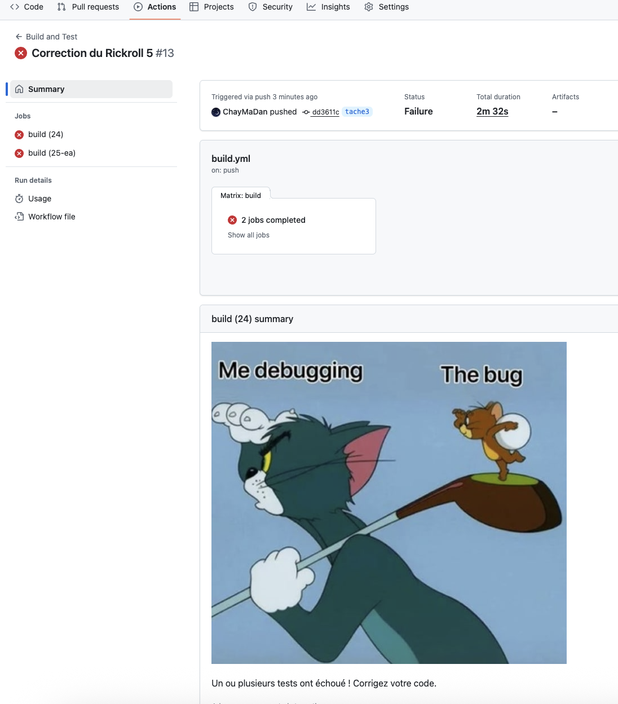
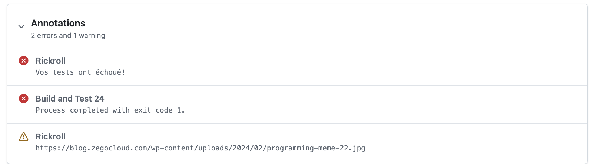
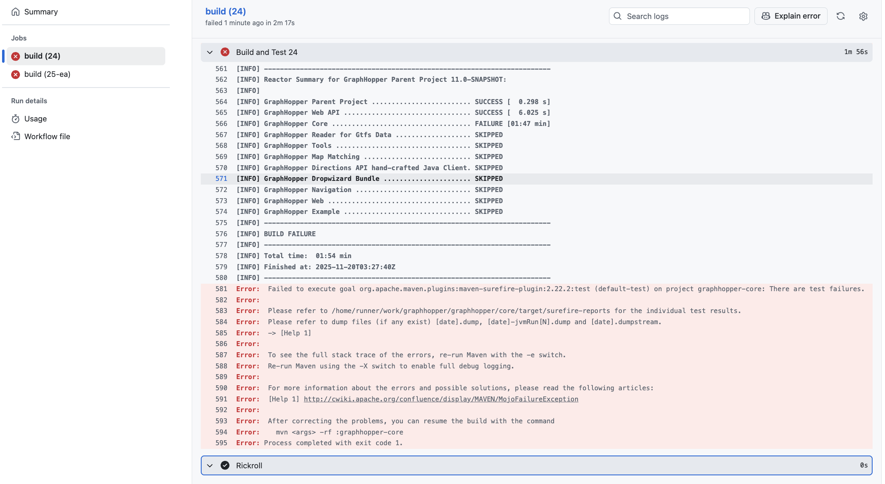
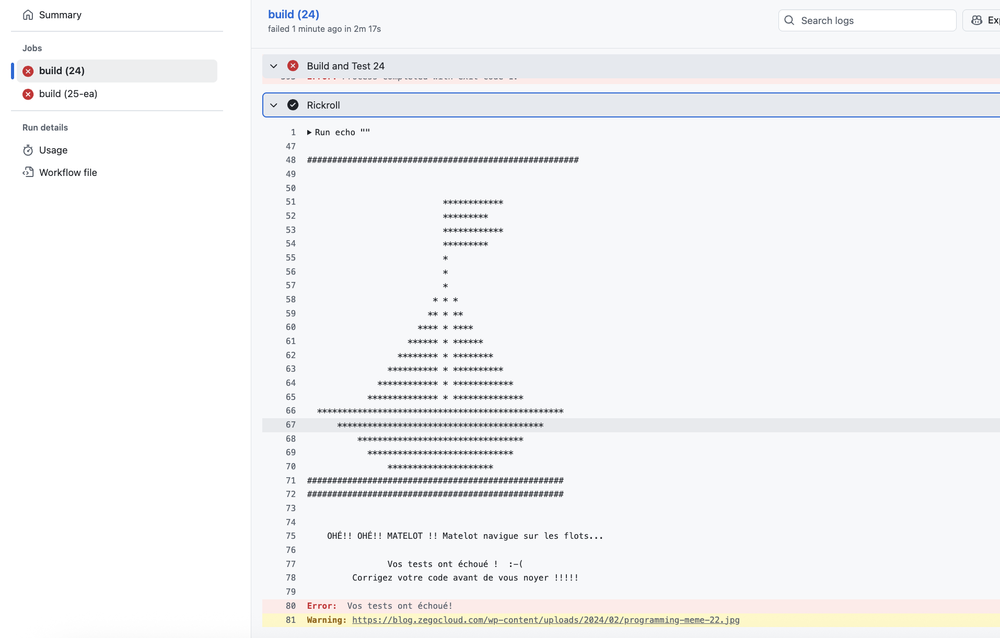
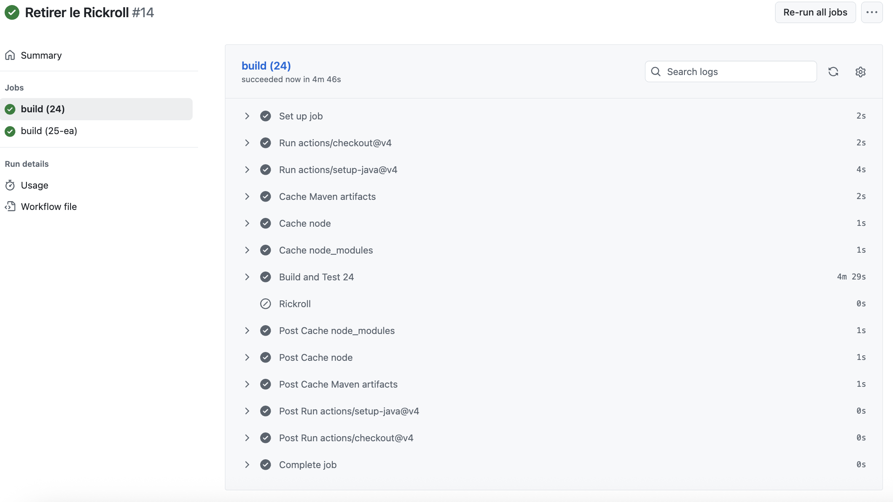

# Tâche 3 : tests d'intégration

**Autrices :** Chaimaa Dannane && Ines Amelia Chafai

**Date :** 21 novembre 2025

---

## Table des matières

1. [Workflow Github Actions](#1-workflow-Github-Actions)
2. [Tests avec mocks](#2-tests-avec-mocks)
3. [Rickroll](#3-rickroll)
---

## 1. Workflow Github Actions

---

## 2. Tests avec mocks

### 2.1 Cas de test 1

**Module :** `core`
**Package :** `com.graphhopper.routing.util` 
**Classe :** `RoadDensityCalculator.java`  
**Chemin :** [core/src/main/java/com/graphhopper/routing/util/RoadDensityCalculator.java](core/src/main/java/com/graphhopper/routing/util/RoadDensityCalculator.java)

### 2.2 Cas de test 2

**Module :** `core`
**Classe :** `QueryGraphWeighting.java`  
**Package :** `com.graphhopper.routing.weighting`
**Chemin :** [core/src/main/java/com/graphhopper/routing/weighting/QueryGraphWeighting.java](core/src/main/java/com/graphhopper/routing/weighting/QueryGraphWeighting.java)

### 2.3 Ajout des dépendances Mockito

**Configuration dans [core/pom.xml](core/pom.xml) :**

```xml
    <dependencies>
        <dependency>
            <groupId>org.mockito</groupId>
            <artifactId>mockito-core</artifactId>
            <scope>test</scope>
        </dependency>
        <dependency>
            <groupId>org.mockito</groupId>
            <artifactId>mockito-junit-jupiter</artifactId>
            <version>5.12.0</version>
            <scope>test</scope>
        </dependency>
    </dependencies>
```

### 2.4 Exécution des tests

**Commande d'exécution des nouveaux tests :**
```bash
cd core
mvn -Dtest=RoadDensityCalculatorTest test
mvn -Dtest=QueryGraphWeightingTest test  
```


### 2.5 Documentation des tests  

**Fichier créé :** [core/src/test/java/com/graphhopper/routing/util/RoadDensityCalculatorTest.java](core/src/test/java/com/graphhopper/routing/util/RoadDensityCalculatorTest.java)


La classe `RoadDensityCalculator` a été choisie pour ses dépendances à la structure de données `Graph` et ses itérateurs d'arêtes. Elle nécesssite des calculs géographiques basés sur les coordonnés des noeuds et donc elle nécessite l'implémentation d'un graphe pour tester son comportement complexe. L'utilisation des mocks nous permet d'isoler la logique métier sans avoir à reproduire à grapje en complet.  

**Classes mockées :**

`Graph` : permet de simuler la structure de données du graphe routier.

`NodeAccess` : permet de simuler l'accès aux coordonnées des nœuds.

`EdgeExplorer` : permet de simuler la navigation à travers les arêtes du graphe.

`EdgeIterator` : permet de simuler l'itération sur les arêtes.

`EdgeIteratorState` : permet de simuler l'état d'une arête.

#### Test 1 : `testCalcRoadDensityWithSimpleGraph`

**Intention du test :**  
Vérifier le calcul de la densité routière `calcRoadDensity()` dans un scénario simple avec des arêtes adjacentes.

**Données de test :**
- **Valeurs simulées :** 
    - Un graphe avec 3 nœuds (0, 1, 2) ; 1 centre (0-1) et 1 arête (0-2).
    - Noeud 0 : (45.5, -73.5)
    - Noeud 1 : (45.5009, -73.5)
    - Noeud 2 : (45.50065, -73.5)
    - Arête entre noeud 0 et noeud 2
    - Rayon de recherche de 200 mètres.
    - Facteur de pondération constant de 1.0 pour toutes les arêtes.

**Oracle :**  
La densité routière calculée doit être égale à 1.0 / 200 / 200 = 2.5e-5

**Vérifications :**
- 3 noeuds explorés
- 4 appels `next()` : exploration complète du graphe
- 3 appels à `getAdjNode()` :récupération des noeuds adjacents 

---

#### Test 2 : `testCalcRoadDensityOutsideradius`

**Intention du test :**  
Vérifier que l'algorithme explore les noeuds à l'extérieur du rayon de recherche mais ne prend en compte que les arêtes à l'intérieur du rayon dans le calcul de la densité.

**Données de test :**
 - **Valeurs simulées :**
    - Graphe avec 4 noeuds (0, 1, 2, 3)
    - Noeud 0 : (45.5, -73.5)
    - Noeud 1 : (45.5, -73.5) pour simplifier le calcul du centre
    - Noeud 2 : (45.5001, -73.5) à l'intérieur du rayon
    - Noeud 3: (45.502, -73.5): à l'extérieur du rayon
    - Arête entre noeud 0 et noeud 2 (pris en compte)
    - Arête entre noeud 2 et noeud 3 ( exploré mais pas pris en compte)
    - Rayon de recherche de 100 mètres.
    - Facteur de pondération constant de 1.0 pour toutes les arêtes.

**Oracle :**  
la densité routière doit être égale à  1.0 / 100 / 100 = 1.0e-4. Seul l'arête (route) entre 0 et 2 est prise en compte 

**Vérifications :**
- 3 noeuds explorés (le noeud 3 n,est pas exploré car trop loin)
- 5 appels `next()` : exploration complète du graphe
- 4 appels à `getAdjNode()` :récupération des noeuds adjacents 

---

#### Test 3 : `testCalcRoadDensityNoAdjacentEdges`

**Intention du test :**  
Vérifier que la méthode `calcRoadDensity` gère correctement un graphe minimal. La méthode retourne une densité de 0.0 lorsque aucune arête adjacente n'est relié à l'arête de départ (par exemple, une route isolée)

**Données de test :**
- **Valeurs simulées :**
    - Un graphe avec 2 nœuds (0, 1) et une seule arête (0-1).
    - Noeud 0 : (45.5, -73.5)
    - Noeud 1 : (45.5009, -73.5)
    - Rayon de recherche de 200 mètres.
    - Facteur de pondération constant de 1.0 pour toutes les arêtes.

**Oracle :**  
La densité routière doit être égale exactement à 0.0. 

**Vérifications :**
- 2 noeuds explorés 
- 2 appels `next()` : exploration complète du graphe
- `getAdjNode()` n,est jamais appelé car aucune arête n'est trouvée

---

#### Test 4 : `testCalcRoadDensityNodeVisited`

**Intention du test :**  
Vérifier que la méthode `calcRoadDensity` ne compte pas deux fois les arêtes des noeuds déjà vistés (éviter de tourner en rond).

**Données de test :**
- **Valeurs simulées :**
    - Un graphe avec 2 nœuds (0, 1) et une seule arête (0-1).
    - Noeud 0 : (45.5, -73.5)
    - Noeud 1 : (45.5001, -73.5)
    - Noeud 2 : (45.5, -73.5)
    - Arête entre 0 et 2 (pris en compte car première découverte du noeud 2)
    - Arête entre 1 et 2 (2 déjà visité donc ignoré)
    - Arête entre 2 et 0 (2 déjà visité donc ignoré)
    - Rayon de recherche de 100 mètres.
    - Facteur de pondération constant de 1.0 pour toutes les arêtes.

**Oracle :**  
la densité routière doit être égale à  1.0 / 100 / 100 = 1.0e-4. Seul l'arête (route) entre 0 et 2 est prise en compte.

**Vérifications :**
- 3 noeuds explorés 
- 6 appels `next()` : exploration complète du graphe

---

#### Erreur rencontrée
Lors de l'exécuton des tests 2 et 4, une erreur est apparue : 
```bash
[ERROR] Errors: 
[ERROR]   RoadDensityCalculatorTest.testCalcRoadDensityNodeVisited » UnnecessaryStubbing
[ERROR]   RoadDensityCalculatorTest.testCalcRoadDensityOutsideradius » UnnecessaryStubbing
```

Mockito, par défaut en mode strict, détecte les stubs qui ont été définis mais jamais utilisés durant l'exécution du test. 

Dans le teste 2 `testCalcRoadDensityOutsideradius`, nous avons ajouté un noeud 3 qui est à l'extérieur du rayon. L,objectif est de tester si l'algorithme explore ce noeud mais ne l'inclut pas dans le calcul de la densité.
Bien que le calcul soit correct (validé en testant avec une valeur erronée qui déclenche l'assertion attendue), Mockito détecte que certains stubs configurés (noeud 3) ne sont jamais utilisés, générant ainsi une erreur `UnnecessaryStubbing`.

De même pour le test 4 `testCalcRoadDensityNodeVisited`, nous simulons des noeuds et même des arêtes qui sont explorés mais comme ils ne contribuent pas dans le calcul de la densité, ceci déclenche une erreur de Mockito.
 
Une solution a été d'introduire au code cette annotation `@MockitoSettings(strictness = Strictness.LENIENT)`. cette configuration permet nous de rendre Mockito plus fexible et d'ignorer les stubs qui ne sont pas utilisés

---
**Fichier créé :** [core/src/test/java/com/graphhopper/routing/weighting/QueryGraphWeightingTest.java](core/src/test/java/com/graphhopper/routing/weighting/QueryGraphWeightingTest.java)


La classe `QueryGraphWeighting` gère les calculs de coûts sur les virages. dans un graphe routiers, nous avons les noeuds et arêtes réels comme des intersections ou des routes définies et des noeuds et arêtes virtuels comme ta maison ou ton écoles (des points au mileu d'arêtes réelles). Selon le type de noeud et d'arêtes, il existe des règles qui permettent de calculer les coûts sur les virages. 

Cette utilise deux dépendances,`BaseGraph` Basegraph qui gère la structure du graphe routier et `Weighting` Weighting qui gère comment attribuer le coût aux virages. Les mocks nous permettent d'isoler la logique métier ces deux classes et de simuler leurs comportements pour bien tester ce problème complexe.

**Classes mockées :**

`BaseGraph` : permet de simuler la structure de données du graphe routier avec des noeuds/arêtes réels et virtuels

`Weighting` : permet de simuler l'interface de calculs de coûts sur les virages. Notre classe QueryGraphWeighting délègue à Weighting la logique sur les calculs 

#### Test 1 : `testCalcTurnWeightUturnVirtualNode`

**Intention du test :**  
Nous cherchons à tester la méthode `calcTurnWeight(int inEdge, int viaNode, int outEdge)` pour vérifier que la classe interdit les UTurn dans les noeuds virtuels en lui assignant un coût infini.
       
**Données de test :**
- **Valeurs simulées :** 
    - viaNode == virtualNode = 10 : le premier noeud virtuel dans le graphe simulé
    - virtualEdge = 15 : la première arête virtuelle dans le graphe simulé
    - inEdge = outEdge : même arête en entrée et sortie pour simuler un (virage) U Turn

**Oracle :**  
Le coût sur ce virage doit être Double.POSITIVE_INFINITY (car le U Turn est interdit)

**Vérifications :**
la méthode `weigthing.calcTurnWeight` ne doit pas être appelé car le code détecte si un virage est UTurn (interdit) sans consulter l'interface `Weighting`. 
    
---

#### Test 2 : `testCalcTurnWeightTurnRealNode`

**Intention du test :**  
Vérifier que pour un noeud et des arêtes réels, la classe `QueryGraphWeighting` délègue correctement à `Weighting` la logique sur le calcul des coûts.

**Données de test :**
 - **Valeurs simulées :**
    - realNode = 5 : noeud réel (< 10) où se passe le virage 
    - inEdge = 10 : arête réelle (< 15) entrante
    - outEdge = 12 : arête réelle (< 15) sortante
    - turnWeightExpected = 20, on ne sait pas le coût sur le virage que doit retourner l'objet Weighting donc on le simule et il doit être retourné par le mock

**Oracle :**  
Le coût sur ce virage doit être 20 (valeur du mock). 

**Vérifications :**
- La méthode `weigthing.calcTurnWeight` doit être appelé une fois pour 1 virage

---

## 3. Rickroll

**Fichier modifié :** [.github/workflows/build.yml](.github/workflows/build.yml)

Nous avons fait une implémentation simple du Rickroll en YAML.

Le workflow utilise la condition `if: failure()` pour détecter l'échec à l'étape des tests Maven et déclenche automatiquement le rickroll. 

Sur Github, nous pouvons voir ce qui se passe quand un test échoue.

- L'étape `Build and Test` échoue : ici, nous pouvons voir que l'exécution des tests a échoué à cause du test désigné à l'échec dans la classe `QueryGraphWeightingTest.java`.
Le test a été mis en commentaire, vous pouvez le retirer pour tester de votre côté.

- L'étape `Rickroll` affiche un message pour informer de l'échec des tests

- Le workflow global reste en échec









**Commande pour voir le rickroll :**

D'abord, il faut retirer le commentaire du test désigné pour l'échec dans la classe `QueryGraphWeightingTest.java` ou tout simplement écrire un test qui va échouer.

Ensuite, il faut faire un commit et le pousser. 

```bash
git add .
git commit -m "Tester le rickroll"
git push origin branch-actuelle
```

Nous avons aussi testé lorsque tous les tests réussissent, et nous pouvons clairement voir que l'étape du `Rickroll` est ignorée. 



---

## Annexes

### Fichiers sources

- **Classes testées :** [core/src/main/java/com/graphhopper/routing/util/RoadDensityCalculator.java](core/src/main/java/com/graphhopper/routing/util/RoadDensityCalculator.java)

[core/src/main/java/com/graphhopper/routing/weighting/QueryGraphWeighting.java](core/src/main/java/com/graphhopper/routing/weighting/QueryGraphWeighting.java)

- **Nouveaux tests avec mocks:** 
[core/src/test/java/com/graphhopper/routing/util/RoadDensityCalculatorTest.java](core/src/test/java/com/graphhopper/routing/util/RoadDensityCalculatorTest.java)


[core/src/test/java/com/graphhopper/routing/weighting/QueryGraphWeightingTest.java](core/src/test/java/com/graphhopper/routing/weighting/QueryGraphWeightingTest.java)

- **Configuration Maven :** [pom.xml](core/pom.xml)

- **Rickroll Build:** 
[.github/workflows/build.yml](.github/workflows/build.yml)

---
